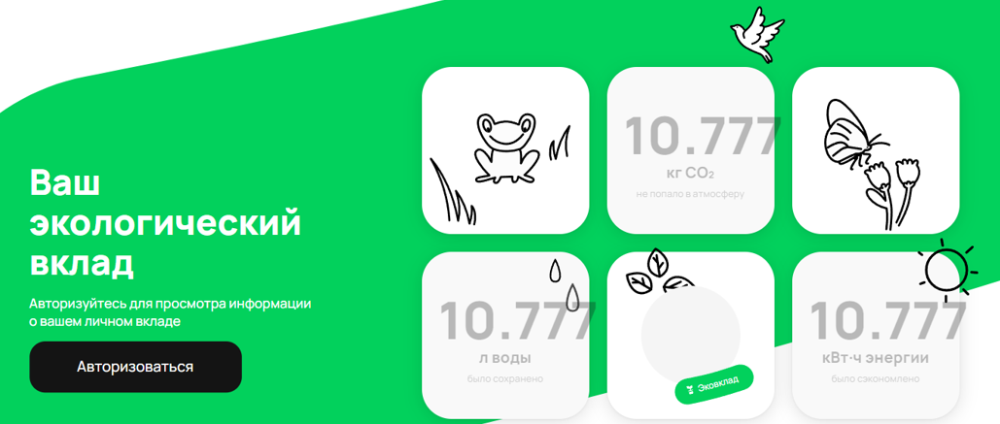

# Описание
Значение в счётчиках вылезает за границы элемента.

# Локация дефекта
Не могу указать локацию дефекта.

# Шаги воспроизведения
1. Открыть [код тестов]() в IDEA.
1. Открыть [страницу avito](https://www.avito.ru/avito-care/eco-impact) в браузере.
1. Прокрутить страницу до трёх счётчиков. (CO₂, л. воды, кВт⋅ч энергии)
1. Отредактировать счётчик "CO₂" данными ```10.777```
1. Отредактировать счётчик "л. воды" данными ```10.777```
1. Отредактировать счётчик "кВт⋅ч энергии" данными ```10.777```

*Ожидаемый результат :* данные в счётчиках отображаются не выходя за границы элемента.
*Фактический результат :*  данные в счётчиках отображаются выходя за границы элемента.

# Тест
p

# Скриншот
1. Скриншот № 1
   

# Окружение
* **Операционная система:** Windows 10 Pro 21H2
* **IDE:** IntelliJ IDEA Community Edition 2022.2.3
* **Java:** OpenJDK 11
 
