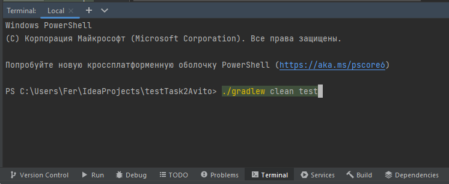
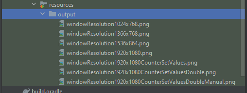

### Процедура запуска автотестов

## Для запуска авто тестов необходимо следующие окружение.
* **IDE:** IntelliJ IDEA Community Edition 2022.2.3 (или новее)
* **Java:** OpenJDK 11
## Для запуска авто тестов нужны следующие действия.
1. Выполнить ```git clone``` проекта
1. Запустить Intellij idea
1. Открыть проект через Intellij idea
1. В терминале Intellij idea выполнить команду ```./gradlew clean test```
1. После выполнения тестов командой ```./gradlew clean test``` в папке ```testTask2Avito\src\test\resources\output``` появятся скриншоты. 