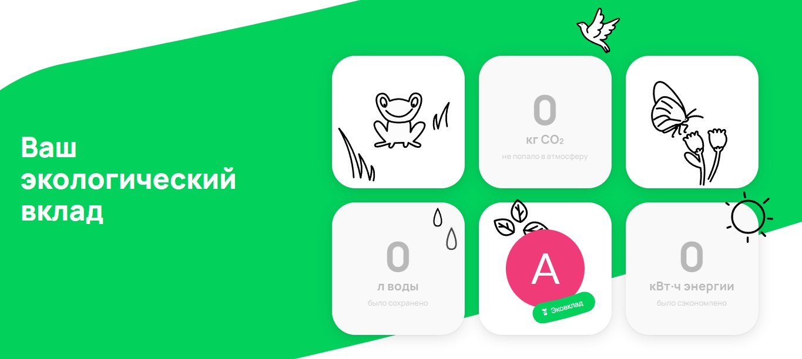

# Перечень автоматизируемых сценариев.

#### Предусловие для тестов
1. Открыть браузер google chrome
1. Открыть страницу [Avito](https://www.avito.ru/avito-care/eco-impact).

##### Данные для заполнения
Данные для счётчиков будут генерироваться случайным образом.

<br>

##### Пример отображение счётчиков после прокрутки страницы.


<br>

#### Тестирование прокрутки страницы до счётчиков при разных разрешениях окна браузера.

1. Прокрутка страницы [Avito](https://www.avito.ru/avito-care/eco-impact) в разрешении 1920x1080.
    1. Открыть страницу [Avito](https://www.avito.ru/avito-care/eco-impact).
    1. Изменить разрешение окна браузера на 1920x1080.
    1. Прокрутить страницу до трёх счётчиков. (CO₂, л. воды, кВт⋅ч энергии)
    1. Удостовериться что вёрстка отображается нормально.
       <br>
       *Ожидаемый результат* - все три счётчика видны, элементы вёрстки не наслаиваются, вёрстка не "поехала".

1. Прокрутка страницы [Avito](https://www.avito.ru/avito-care/eco-impact) в разрешении 1366x768.
    1. Открыть страницу [Avito](https://www.avito.ru/avito-care/eco-impact).
    1. Изменить разрешение окна браузера на 1366x768.
    1. Прокрутить страницу до трёх счётчиков. (CO₂, л. воды, кВт⋅ч энергии)
    1. Удостовериться что вёрстка отображается нормально.
       <br>
       *Ожидаемый результат* - все три счётчика видны, элементы вёрстки не наслаиваются,  вёрстка не "поехала".

1. Прокрутка страницы [Avito](https://www.avito.ru/avito-care/eco-impact) в разрешении 1536x864.
    1. Открыть страницу [Avito](https://www.avito.ru/avito-care/eco-impact).
    1. Изменить разрешение окна браузера на 1536x864.
    1. Прокрутить страницу до трёх счётчиков. (CO₂, л. воды, кВт⋅ч энергии)
    1. Удостовериться что вёрстка отображается нормально.
       <br>
       *Ожидаемый результат* - все три счётчика видны, элементы вёрстки не наслаиваются,  вёрстка не "поехала".

1. Прокрутка страницы [Avito](https://www.avito.ru/avito-care/eco-impact) в разрешении 1024x768.
    1. Открыть страницу [Avito](https://www.avito.ru/avito-care/eco-impact).
    1. Изменить разрешение окна браузера на 1024x768.
    1. Прокрутить страницу до трёх счётчиков. (CO₂, л. воды, кВт⋅ч энергии)
    1. Удостовериться что вёрстка отображается нормально.
       <br>
       *Ожидаемый результат* - все три счётчика видны, элементы вёрстки не наслаиваются,  вёрстка не "поехала".

#### Тестирование отображения значений в счётчиках.

1. Отображение целых чисел в счётчиках.
    1. Открыть страницу [Avito](https://www.avito.ru/avito-care/eco-impact).
    1. Изменить разрешение окна браузера на 1920x1080.
    1. Прокрутить страницу до трёх счётчиков. (CO₂, л. воды, кВт⋅ч энергии)
    1. Отредактировать счётчик "CO₂" данными ```123```
    1. Отредактировать счётчик "л. воды" данными ```123```
    1. Отредактировать счётчик "кВт⋅ч энергии" данными ```123```
       <br>
       *Ожидаемый результат* - данные в счётчиках отображаются не выходя за границы элемента.

1. Отображение десятичных чисел в счётчиках.
    1. Открыть страницу [Avito](https://www.avito.ru/avito-care/eco-impact).
    1. Изменить разрешение окна браузера на 1920x1080.
    1. Прокрутить страницу до трёх счётчиков. (CO₂, л. воды, кВт⋅ч энергии)
    1. Отредактировать счётчик "CO₂" данными ```3,777```
    1. Отредактировать счётчик "л. воды" данными ```3,777```
    1. Отредактировать счётчик "кВт⋅ч энергии" данными ```3,777```
       <br>
       *Ожидаемый результат* - данные в счётчиках отображаются не выходя за границы элемента.

1. Отображение десятичных чисел в счётчиках.
    1. Открыть страницу [Avito](https://www.avito.ru/avito-care/eco-impact).
    1. Изменить разрешение окна браузера на 1920x1080.
    1. Прокрутить страницу до трёх счётчиков. (CO₂, л. воды, кВт⋅ч энергии)
    1. Отредактировать счётчик "CO₂" данными ```10.777```
    1. Отредактировать счётчик "л. воды" данными ```10.777```
    1. Отредактировать счётчик "кВт⋅ч энергии" данными ```10.777```
       <br>
       *Ожидаемый результат* - данные в счётчиках отображаются не выходя за границы элемента.

