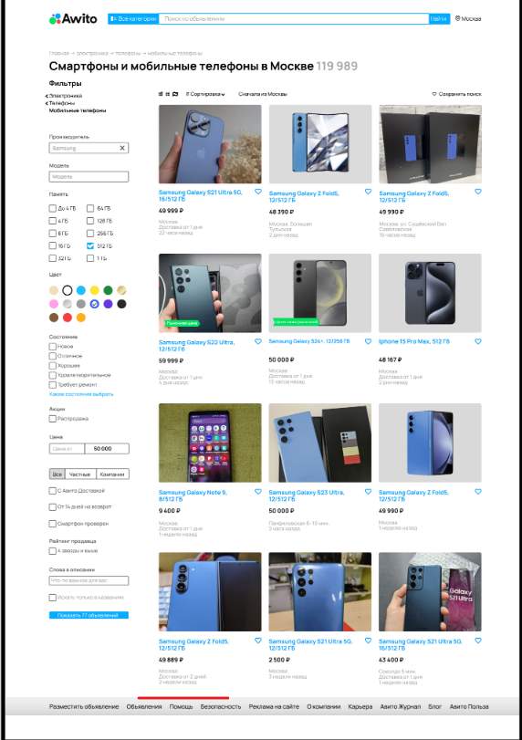

1. Отсутствуют кнопки для перехода на след./пред. страницу.
   1. приоритет high
   1. На месте красной черты должны быть кнопки для перехода на след./пред. страницу 
1. Сортировка по производителю пропускает устройства других производителей.
    1. приоритет medium
    1. Скрин 
1. Сортировка по памяти не отсеивает не подходящие устройства.
    1. приоритет medium
    1. Скрин 
1. Сортировка по цвету не отсеивает не подходящие устройства.
   1. приоритет low
   1. Скрин 
1. Фильтр по максимальной цене товара выдаёт более дорогой товар.
   1. приоритет medium
   1. Скрин 
1. Не совпадает счётчик обьявлений.
   1. приоритет medium
   1. Скрин 

